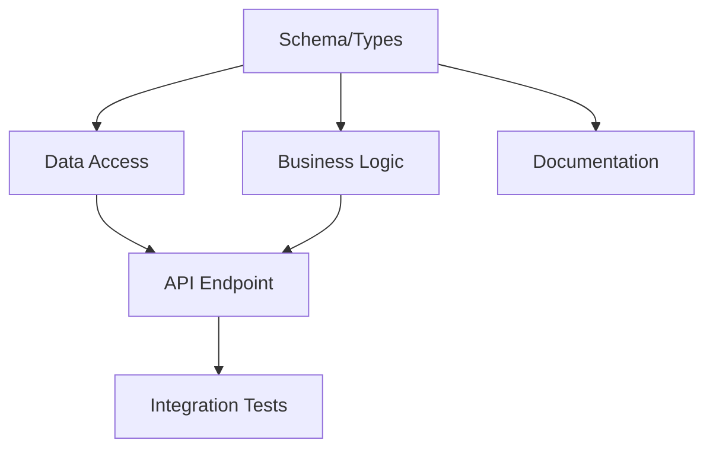

# Pattern: decomposition

**What:** The discipline of breaking complex work into components that can be executed independently, tested independently, and integrated predictably. More than just "split it up" — this is about understanding and encoding the *break patterns* that make decomposition reliable and repeatable.

**When to use:** Any initiative that's bigger than a single work package. This pattern sits between `problem-statement` (what are we solving?) and `work-package` (what's the atomic unit?) — it's the thinking that determines how the units get shaped.

## The Core Principle

> Your job is not to manually write every subtask. Your job is to provide the **break patterns** that a planner agent can use to decompose larger work reliably.

This is a level of abstraction above listing tasks. You're encoding *how to think about splitting this type of work* — which is reusable across similar initiatives.

## The Decomposition Test

Take any project you'd estimate at more than a day of work. Can you break it into subtasks that each:
- Take less than 2 hours of focused work?
- Have clear input/output boundaries?
- Can be verified independently of the other tasks?
- Touch a disjoint set of files (enabling parallelization)?

If a subtask fails this test, it needs further decomposition or it's actually multiple tasks wearing a trenchcoat.

## Break Patterns by Work Type

Different kinds of work decompose along different seams. These are starting templates — refine them through experience.

### API/Backend Feature
1. Schema/types (data shape)
2. Data access layer (queries, mutations)
3. Business logic (validation, transformation)
4. API endpoint (routing, serialization)
5. Integration tests
6. Documentation

Seam: each layer can be built and tested against interfaces/mocks before the next exists.

### UI Feature
1. State module (reactive store, types)
2. Component structure (layout, no logic)
3. Component behavior (events, state binding)
4. API integration (bridge messages, fetch)
5. Visual verification (Playwright screenshots)

Seam: state and structure are independently testable before behavior wires them together.

### Refactor/Migration
1. Characterization tests (capture current behavior)
2. New structure (alongside old, not replacing)
3. Migration logic (old → new)
4. Switchover (swap references)
5. Cleanup (remove old code)

Seam: the old system stays working until step 4. Each step is independently reversible.

### Infrastructure/Config
1. Schema/type changes
2. Default values and migration
3. Validation logic
4. Surfaces (UI, CLI, API that expose the config)
5. Documentation

Seam: the system works with defaults at every step. No step introduces a broken state.

## Dependency Mapping

After decomposition, map dependencies explicitly:
- What must complete before this can start? (precondition)
- What does this enable? (downstream dependents)
- Can this run in parallel with anything? (wave planning — see `wave-execution`)

Visualize with a Mermaid dependency graph. This is not optional for 4+ packages — the visual catches missed parallelism and hidden dependencies that linear lists obscure.

## The "Break Pattern" Abstraction

When you find yourself decomposing a similar type of work for the third time, extract the break pattern:
- What are the natural seams for this type of work?
- What's the typical dependency shape?
- Where does parallelism live?
- What's the riskiest package (the one most likely to force rework)?

This extracted pattern becomes reusable. Next time you face similar work, you don't decompose from scratch — you apply the break pattern and adjust for specifics. This is how the pattern library grows organically.

## Anti-Patterns

- **Decomposing by time** ("morning tasks, afternoon tasks") — fragile, no structural meaning
- **Decomposing by person** ("person A does X, person B does Y") — use capability boundaries, not identity
- **One giant package + cleanup package** — the cleanup package is where scope violations hide
- **Packages that can't be verified independently** — if you can't prove Package 3 works without Package 4 existing, they're one package

## Execution Feedback

### Model recommendation must account for test WP complexity (a real campaign, 2026-03-15)
Orchestrator recommended "all Sonnet except WP-02b (Opus for prompt design)." WP-04 (Tests) timed out at 15.3m with zero output — Sonnet couldn't handle 46 tests across 2 files with complex mock chains (inspectDispatch consumes 3 pool mocks before function-specific queries). **Heuristic:** If a test WP covers >3 functions, requires mock chains >3 deep, or tests state machine transitions, recommend Opus. Alternatively, split test WPs per file (e.g., "recovery tests" + "runner tests" as separate WPs).

### Infrastructure setup vs. behavioral cutover is a natural split seam (a real campaign, 2026-03-15)
WP-05 bundled durable completion infrastructure (new table, drain loop, LISTEN) with dispatch execution cutover (rewiring live task flow). Review council flagged this — split into WP-05a (infrastructure) and WP-05b (cutover). Both dispatched cleanly; WP-05b was later deferred without blocking the rest of the campaign. **Heuristic:** When a WP has both "build the new thing" and "switch live traffic to it," split. The infrastructure piece validates independently and provides rollback safety.

### Untracked files on base branch create invisible add/add conflicts (a real campaign, 2026-04-06)
Spec said "modify `kb.ts`" — both WP-01 and WP-02 in the same wave. File existed in the working tree but was never committed to master. Both agents created it from scratch → add/add merge conflict requiring manual resolution (~30 min delay + cascade into CLI takeover). The existing same-file-same-wave rule (CORRECTIONS.md) didn't cover this: the spec assumed "modify" when reality was "create." **Heuristic:** Pre-campaign, verify every file in every WP's `expectedFiles` exists on the base branch. If it doesn't, commit it first or ensure only one WP creates it. "Modify" and "create" are different operations with different conflict profiles — specs must distinguish them.

---
*Source: phase1-dispatch-mvp-spec.md wave execution results, development-pipeline-spec.md*
*Break pattern abstraction influenced by: Nate B. Jones specification primitives*
*Pipeline: ← `constraint-architecture` | → `work-package`, `wave-execution`*
*See also: `meta-prompt`, `problem-statement`, `verification-criteria`*
