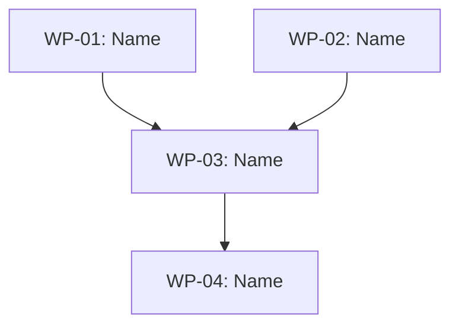

# Orchestrator — {Workshop Title}

{N} packages, {N} waves, {N} project(s) ({project-names}).

<!-- ================================================================
     COORDINATION SECTIONS
     The three sections below (Wave Plan, Package Inventory, Gate Commands)
     are the structured coordination layer. Format matters for execution
     agents and spec-validate. Everything else is for human readers.

     THIS FILE MUST LIVE AT: work-packages/_orchestrator.md
     The workshop directory is derived from dirname(dirname(path)).
     Wrong location = wrong meta.json lookup = confusing errors.
     ================================================================ -->

## Wave Plan

<!-- One line per wave. Packages in [square brackets].
     - Wave numbers must be sequential (1, 2, 3...). Duplicates fail validation.
     - Multiple packages in same wave = same line: Wave 1: [WP-01: Foo] [WP-02: Bar]
     - Lines must NOT be inside ``` code blocks — parser skips fenced content.
     - Package names must contain WP-NN for cross-reference with inventory. -->

Wave 1: [WP-01: Package Name] [WP-02: Package Name]
Wave 2: [WP-03: Package Name]
Wave 3: [WP-04: Package Name]

<!-- ================================================================
     HUMAN-READABLE SECTIONS (not parsed)
     Everything below this point until Package Inventory is for context.
     Include what helps — wave rationale, dependency notes, mermaid graphs.
     ================================================================ -->

### Wave rationale
- **Wave 1** — {why these packages are grouped, what they share, parallel or sequential}
- **Wave 2** — {dependencies on Wave 1, what this wave accomplishes}
- **Wave 3** — {dependencies, integration/validation notes}

<!-- Optional: Mermaid dependency graph

-->

## Gate Commands

<!-- One line per wave. Format: Wave N: {shell command}
     - Commands run with cwd set to the project's worktree automatically.
     - Do NOT use absolute cd paths — they escape the worktree.
     - If omitted entirely, defaults to `npx tsc --noEmit` per project.
     - "human review" is valid for review-only waves. -->

Wave 1: npx tsc --noEmit && npx vitest run
Wave 2: npx tsc --noEmit && npx vitest run
Wave 3: npx tsc --noEmit && npx vitest run

## Package Inventory

<!-- Markdown table. 4 columns required, optional 5th column for Model.
     - Package: must contain WP-NN for cross-reference with Wave Plan
     - Wave: integer wave number
     - Project: the project name (e.g. backend-service, web-frontend)
     - Spec: markdown link to WP file (relative to work-packages/), or - / N/A
     - Model (optional): claude model name for this WP (e.g. opus, sonnet). Use - or omit column for system default. -->

| Package | Wave | Project | Spec | Model |
|---------|------|---------|------|-------|
| WP-01: Package Name | 1 | project-name | [wp-01-slug.md](wp-01-slug.md) | - |
| WP-02: Package Name | 1 | project-name | [wp-02-slug.md](wp-02-slug.md) | - |
| WP-03: Package Name | 2 | project-name | [wp-03-slug.md](wp-03-slug.md) | - |
| WP-04: Package Name | 3 | project-name | [wp-04-slug.md](wp-04-slug.md) | - |

<!-- ================================================================
     SPEC-LEVEL CONSTRAINTS (optional but recommended)
     From constraint-architecture pattern. Apply to ALL packages.
     Omit sections that don't apply — but Musts and Must-Nots are
     almost always worth stating.
     ================================================================ -->

## Spec-Level Constraints

### Musts
1. {Invariant that every package must maintain}
2. {Data integrity, backward compatibility, or safety requirement}

### Must-Nots
1. DO NOT {thing that would break the system or expand scope}
2. DO NOT {modification outside the workshop's boundary}

### Preferences
1. Prefer {approach A} over {approach B} — {reason}
2. Prefer {existing pattern} over {new abstraction}

### Escalation Triggers
1. {Condition that means the agent should stop and ask} — e.g., "If the function has callers outside the listed files, escalate before changing the interface."
2. {Unexpected state that invalidates the spec}

## Progress Log

<!-- Campaign progress log. A single shared file that accumulates context
     across all dispatches in the campaign. Each dispatch agent:
     1. READS this section at session start (context from prior packages)
     2. APPENDS an entry at session end (what it did, what it changed, surprises)

     This is the campaign's institutional memory. Later packages benefit from
     earlier packages' discoveries without the orchestrator holding it all.
     The log also feeds directly into the post-mortem.

     Convention: entries are appended chronologically. Each entry includes
     the package ID, a brief summary, and any notes for downstream packages.
     The file lives here in the orchestrator so all agents already read it. -->

<!-- Progress entries will be appended below by execution agents -->

## Risk Assessment

**Primary risk:** {The single most likely thing to go wrong and why}

**Mitigation:** {How wave ordering, gates, or spec design addresses it}

**Secondary risk:** {Lower-probability concern}

**Cross-wave dependencies:** {Which packages depend on which, beyond wave ordering}

## Dispatch Notes

- {Total scope: lines added/removed, nature of changes}
- {Parallelism notes: which packages in same wave are truly independent}
- {Sequencing constraints within waves, if any}
- {Model recommendations for complex WPs, if applicable}
