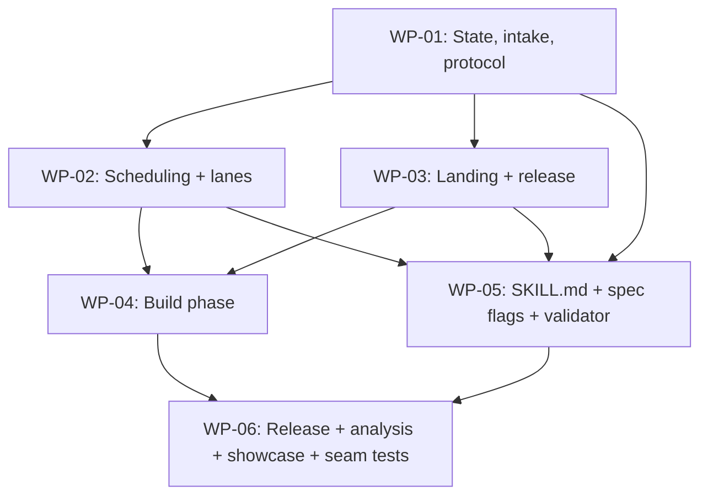

# Orchestrator — Goal conductor: one skill takes a stated goal end to end

6 packages, 4 waves, 1 project (workit).

## Wave Plan

Wave 1: [WP-01: State, intake and the next/record protocol]
Wave 2: [WP-02: Scheduling and lane backends] [WP-03: Landing, review lens, gate, merge, release recipes]
Wave 3: [WP-04: The build phase] [WP-05: SKILL.md, registration, template graduation, spec preapproved, validator fields]
Wave 4: [WP-06: Release, analysis, showcase and the end-to-end seam tests]

### Wave rationale
- **Wave 1:** WP-01 fixes the state schema, the action JSON, the step and seam vocabulary, the CLI and the executor primitives. Everything else reads them.
- **Wave 2:** WP-02 and WP-03 are libraries over WP-01's state, with disjoint files. Each exports one recorder (`recordLaneStep`, `recordLandStep`; D19.15). They run as two concurrent lanes.
- **Wave 3:** WP-04 wires the libraries into the build phase and proves it with unit tests on a fake executor (`lib/phases/build.test.mjs`). WP-05 writes the procedure document, the spec-skill flags and the validator's field enforcement, in parallel. Disjoint files.
- **Wave 4:** WP-06 adds release, analyze and showcase, switches `mint` to `parseWorkPackages`, and proves the whole run with the scripted seam tests and a real-agent runtime exercise. It runs after WP-05 so its final integration sees the real `/spec` producer changes (D19.29).

**The dependsOn rule** (what `parseWorkPackages` computes and the scheduler obeys): a WP depends on the WP ids named in its `**Precondition:**` that sit in earlier waves, **union** every WP of the immediately preceding wave. Here: WP-02 and WP-03 → `['WP-01']`; WP-04 → `['WP-02','WP-03']`; WP-05 → `['WP-01','WP-02','WP-03']` (its precondition names WP-01); WP-06 → `['WP-04','WP-05']`.



## Gate Commands

Wave 1: node --test
Wave 2: node --test
Wave 3: node --test
Wave 4: node --test

**Suite ownership (D19.30):** workit has zero dependencies and a short suite, so lanes run the full `node --test` before the PR boundary (the run's lane contract carries this in its `<Per-repo lane isolation …>` slot, filled from `.workit/conduct.json` `laneSuite`), and the conductor runs it once more at the candidate head (the `gate-cmd` step).

## Package Inventory

| Package | Wave | Project | Spec | Model |
|---------|------|---------|------|-------|
| WP-01: State, intake and the next/record protocol | 1 | workit | [wp-01-state-intake-protocol.md](wp-01-state-intake-protocol.md) | opus |
| WP-02: Scheduling and lane backends | 2 | workit | [wp-02-schedule-lanes.md](wp-02-schedule-lanes.md) | opus |
| WP-03: Landing, review lens, gate, merge, release recipes | 2 | workit | [wp-03-land-release.md](wp-03-land-release.md) | opus |
| WP-04: The build phase | 3 | workit | [wp-04-build-phase.md](wp-04-build-phase.md) | opus |
| WP-05: SKILL.md, registration, template graduation, spec preapproved, validator fields | 3 | workit | [wp-05-skill-md-registration.md](wp-05-skill-md-registration.md) | sonnet |
| WP-06: Release, analysis, showcase and the end-to-end seam tests | 4 | workit | [wp-06-release-analysis-seam.md](wp-06-release-analysis-seam.md) | opus |

## The `**Files:**` field rule (binding on every WP file; `parseWorkPackages` reads it)

A WP's file set is read **only** from bullet lines directly under its `**Files:**` label that begin `- Create ` or `- Modify `, taking the **first** backticked token on each such line. The list ends at the next line that begins with a `**<Field>:**` label (D19); bold text inside a bullet does not end it. Brace groups expand (`lib/phases/{a,b}.mjs` → two paths); a token ending in `/` is a directory. Every other backticked token, on those lines or anywhere else, is a reference, not a file the WP writes. Paths are repo-relative and written in full (`skills/conduct/scripts/lib/state.mjs`).

WP-05 makes this rule, `**Review tier:**` and `**Runtime exercise:**` required fields of every deep WP that `/spec` writes (Stage 6, `reference/patterns/work-package.md`, `reference/templates/_orchestrator.template.md`; D18), and makes `skills/spec-validate/scripts/validate.mjs` reject a WP missing any of them (D19.25). Until a spec carries them, `parseWorkPackages` fails safe: a WP whose parsed `files` is empty conflicts with every other WP and runs alone (WP-02, D18).

## Shared contract (WP-01 implements it; later WPs extend it only as stated here)

**Extension rule:** a later WP may **add** an optional field to `state.json` or to an action, or an optional CLI flag, provided it documents the addition in its report and every consumer tolerates its absence. Renaming, removing, or changing the meaning of an existing field, verb or exit code is a contract change: stop and ask (E1).

### CLI (`skills/conduct/scripts/conduct.mjs`)

| Verb | Arguments | Output (stdout, one JSON object unless noted) | Exit | Owner |
|---|---|---|---|---|
| `intake` | `--goal <text> --repo <abs> [--anchor <quest id>] [--budget <usd>] [--lanes <1\|2>] [--agent claude\|codex] [--adapter <name>]… [--no-adapter <name>]… [--release <json file>] [--runs-root <dir>]` | `{ ok, runDir, action }` | 0 · 2 refusal/usage (no state written; an existing run's files unchanged). `--no-adapter claude` or `codex` is a usage error: agent CLIs are not adapters (D16) | WP-01 |
| `next` | `--run <dir>` | `{ ok, action }` | 0 · 2 corrupt state, an unfilled emission placeholder (D18), or a verb run from a plugin root other than `state.pluginRoot` after a self-hosted release (names the new root; D19.22) · 4 phase handler missing | WP-01 |
| `record` | `--run <dir> --action <id> (--result <json> \| --result-file <path>) [--manual]` | `{ ok, phase, action }` (the next action) | 0 (re-recording the last recorded id is a no-op, exit 0, no event; D19.19) · 2 invalid result (including a `shell` result with no numeric `code`, D18) · 3 attribution refused · 5 unknown or stale action id | WP-01 |
| `answer` | `--run <dir> --touch <n> --key <a..f> [--text <text>]` | `{ ok, touch }` | 0 · 3 stdin not a TTY · 5 no such open touch | WP-01 |
| `status` | `--run <dir>` | human-readable summary (not JSON) | 0 | WP-01 |
| `analyze` | `--run <dir>` | `{ ok, path }`; writes `<run>/run-analysis.md` | 0 · 2 · 4 module missing | WP-01 dispatches to `lib/analyze.mjs` (WP-06) through `deps.importModule` |
| `lane` | `<spawn\|alive\|check> --run <dir> --wp <id>` plus the sub-verb's own flags: `spawn [--amend <brief>]`, `alive`, `check [--pr <n>] [--runtime-only]` | sub-verb output (`check`: `{ ok, verdict, failures[] }`) | 0 · 1 `alive` only: the agent process exited · 2 usage or unknown sub · 4 module missing · 5 check failed | WP-01 dispatches to `lib/lanes.mjs` `runLaneVerb` (WP-02) through `deps.importModule` |
| `land` | `<gate\|merged> --run <dir> --wp <id\|release>` plus `merged --merge-sha <sha>` (D15.1; `--wp release` names the release PR, a WP-shaped view of `state.release`, tier T0, D17) | `gate`: the `gateCheck` JSON; `merged`: `{ ok, head, mergeSha }` | 0 ok · 2 usage or unknown sub · 4 module missing · 5 failed · 6 pending (`gate` only: CI still running at head, D13) | WP-01 dispatches to `lib/land.mjs` `runLandVerb` (WP-03) through `deps.importModule` |

`conduct.mjs` with no verb prints usage to stderr and exits 2 (WP-01, D18). `--resume <dir>` is an alias of `next --run <dir>`. Terminal phases `closed`, `declined` and `sent-back` (D19.5) are handled in `conduct.mjs` itself: `next` returns `{ kind: 'done' }`. Every verb is one-shot (MN1); the only process that outlives a verb is the exec lane backend's agent, spawned detached by `lane spawn` and recorded by pid.

**Sub-verb I/O (D15.1, D19.21):** `conduct.mjs` parses `--run` and `--wp` for `lane` and `land` and calls `runLaneVerb(sub, { runDir, wpId, flags }, deps)` / `runLandVerb(sub, { runDir, wpId, flags }, deps)`, where `flags` holds every other flag camelCased (`--runtime-only` → `runtimeOnly`, `--merge-sha` → `mergeSha`). Each returns `{ code, out }`; `conduct.mjs` prints `out` and sets `process.exitCode = code`. Each sub-verb validates its own flags. **`next` never runs a program:** every check (`lane check`, `land gate`, `land merged`, the gate command, `analyze`) is a `shell` action whose output the agent records. `lane check` and `land gate|merged` print and do not write state; `record` of their `shell` action stores the printed JSON (`wps[].runtimeVerdict`, `wps[].gate`). `lane spawn` is the one sub-verb that writes state (the pid).

**Plugin-root handover (D19.22):** once a self-hosted release has stored `state.handover`, every verb invoked from a `deps.pluginRoot` other than `state.pluginRoot` exits 2, naming `state.pluginRoot`. The agent re-runs the verb with the new root's `conduct.mjs`.

### Executor primitives (`lib/exec.mjs`, WP-01)

- `execute(program, args, { cwd, input })` → `{ code, stdout, stderr }`: re-exported from `scripts/lane.mjs:188` (synchronous `execFileSync`).
- `spawnDetached(program, args, { cwd, logPath, env })` → `{ pid }`: `child_process.spawn` with `detached: true`, `stdio: ['ignore', logFd, logFd]`, `windowsHide: true`, then `unref()`.
- `pidAlive(pid)` → boolean: `process.kill(pid, 0)`; `EPERM` counts as alive, `ESRCH` as gone.
- `resolveProgram(name, { platform, resolveCodex = defaultCodexExe })`: `codex` on win32 → `resolveCodex({ platform })`, default `defaultCodexExe` imported from `skills/slim-review/scripts/pr-review.mjs:1130` (the npm `.cmd` shim cannot be run by `execFileSync` without a shell, measured); every other name unchanged. `defaultCodexExe` runs `cmd.exe … npm root -g` outside the executor (`pr-review.mjs:1135`) and throws when codex is absent (`:1142`), so `resolveProgram` lets the throw through and its caller catches it: in `detectAdapters`, a throw marks codex absent with the message and never crashes intake (D16).
- `shellArgv(command, platform)` → `['cmd.exe', '/d', '/s', '/c', command]` on win32, `['sh', '-c', command]` elsewhere. **Shell strings (D18):** the orchestrator's gate command, `WORKIT_SPEND_CMD` and `WORKIT_NOTIFY_CMD` are shell strings and reach the executor only through `shellArgv`. Recipe `after`/`verify` strings keep D16's whitespace split (`recipeArgv`). **Quote rule (D18, D19):** on win32 a shell string containing `"` is never run: `detectAdapters` marks spend/notify off with the reason (WP-01), and the build's `gate-cmd` step is `not-exercised` with the reason (WP-04).

### Run layout

`<workshop>/` resolves in this order, first match wins (D15.4): `--runs-root <dir>` → `<dir>/<slug>/`; `WORKIT_WORKSPACE_ROOT` → `<root>/data/outputs/workshops/<slug>/`; the nearest ancestor of `--repo` containing both `projects/` and `data/` → `<ancestor>/data/outputs/workshops/<slug>/`; else `~/.workit/runs/<slug>/`. An explicit flag always wins. The run dir is `<workshop>/run/`: `state.json`, `events.jsonl`, `touches/` (including `1-grant.json` after a touch-1 (c) answer, D19.1), `rulings/` (conductor rulings on lane asks, D19.3), `_lane-contract.md` (the build phase's first action, D15.2), `wp-00.md` (depth `none` only, D16), lane briefs at `<run>/lane-<wp-id-lower>.md`, stored as `wps[].lane.briefPath` (D20), and reports (the report path is `<run>/lane-<wp-id-lower>-report.md` on both backends, D18), `lane-runner.jsonl` (herdr), `lane-<wp-id-lower>.log` (exec), `reviews/` (including `reviews/<wp-id-lower>/attempt-ref-r<round>.json` on managed repos, D19.12, and the reply bodies `reviews/<wp-id-lower>/replies/<comment-id>.md`, D20), `council/<wp-id-lower>/` (the council's `meta.json` and one `review-<round>/` output dir per round; never `/spec`'s `reviews/review-1/`, D20), `t1.jsonl`, `run-analysis.md`. `/spec` is told this workshop path explicitly (`--workshop <abs>`, added to the spec skill by WP-05).

**Worktrees sit beside the repo, never in the run dir (D15.3):** exec lanes at `<repo parent>/<repo name>-wt-<slug>-<wp-id-lower>`, the release at `<repo parent>/<repo name>-wt-<slug>-release`; herdr lanes at the path `lane.mjs create` returns, which `--slug <slug>-<wp-id-lower>` makes the same name (`scripts/lane.mjs:910`). Inside a projects tree the worktrees stay inside it, so council's `code_root` confinement holds (`scripts/lane.mjs:906-909`).

### `state.json` (schemaVersion 1)

```json
{
  "schemaVersion": 1,
  "slug": "goal-conductor", "createdAt": "<ISO>",
  "runDir": "<abs>", "workshopDir": "<abs>", "pluginRoot": "<abs>",
  "intent": { "goal": "<verbatim>", "repo": { "path": "<abs>", "remote": "owner/name", "defaultBranch": "main" },
              "anchor": null, "campaign": null, "budgetUsd": 25, "lanesCap": 2, "agent": "claude", "release": null,
              "ciWorkflows": 2 },
  "agents": { "claude": { "on": true, "evidence": "probed", "detail": "<version line, or the probe's error>" },
              "codex": { "on": false, "evidence": "probed", "detail": "<string>" } },
  "adapters": { "<herdr|notify|spend|spine|council|kb|verify>": { "on": true, "evidence": "probed|declared|forced-off", "detail": "<string>" } },
  "phase": "intake|preapproval|spec|mint|build|release|analyze|showcase|closed|declined|sent-back",
  "authority": { "merge": false, "release": false, "budgetUsd": 0, "metered": false, "scope": "<goal or narrowing>", "notes": null, "grant": null },
  "touches": [ { "n": 1, "kind": "preapproval|showcase|blocked", "status": "open|filed|answered",
                 "tag": "[conduct <slug> touch 1]", "wpId": null, "suspendedStep": null,
                 "question": "<tag> <DO/EXPECT>", "options": [ { "key": "a", "label": "", "consequence": "" } ], "allowFreeText": true,
                 "receiptId": null, "file": "touches/1.md", "answer": null } ],
  "spec": { "depth": null, "reviewLevel": null, "gate": null, "gateCommand": null },
  "wps": [ { "id": "WP-01", "name": "", "specPath": "<abs>", "wave": 1, "files": [], "dependsOn": [], "tier": "T1", "model": "opus", "runtimeExercise": "<the WP's Runtime exercise field, verbatim; 'none: <why>' allowed>",
             "questId": null, "state": "pending", "reason": null, "dispatchedAt": null, "queue": [],
             "lane": { "backend": "exec|herdr", "name": "<slug>-wp-01", "worktree": "<abs>", "branch": "conduct/<slug>/wp-01",
                       "base": "<sha>", "briefPath": "<run>/lane-wp-01.md", "paneId": null, "pid": null, "sessionId": null, "logPath": null, "startedAt": null,
                       "deadline": "<ISO>", "costUsd": null },
             "runtimeVerdict": null,
             "rulings": [ { "n": 1, "file": "rulings/wp-01-1.json", "ruled": "a", "escalate": false } ],
             "pr": { "number": 0, "head": "<sha>" },
             "reviews": [ { "round": 1, "scope": "full|delta", "tier": "T1", "head": "<sha>", "lenses": ["codex","astra"],
                            "attemptRef": "<run>/reviews/wp-01/attempt-ref-r1.json", "reviewId": null, "findings": 0, "verdicts": [], "resolved": [] } ],
             "rebases": [ { "from": "<sha>", "to": "<sha>", "oldBase": "<sha>", "newBase": "<sha>",
                            "patchIds": { "from": "<id>", "to": "<id>" }, "equivalent": true } ],
             "gate": null,
             "merge": { "sha": "<merge commit sha>" } } ],
  "release": { "state": "pending|not-exercised|failed|done", "reason": null, "base": null, "worktree": null, "branch": null, "pr": null, "gate": null, "merge": null, "version": null },
  "mergeLock": null,
  "dispatchHalt": null,
  "handover": null,
  "sentBack": null,
  "pending": null,
  "lastRecorded": null,
  "seq": 0
}
```

`wps[].lane`, `pr`, `gate` and `merge` are `null` until set; `rebases`, `rulings` and `queue` are `[]` until used. Field notes:
- `agents` holds the probed lane-agent CLIs (`claude`, `codex`); `adapters` holds only the adapters (`herdr`, `notify`, `spend` probed; `spine`, `council`, `kb`, `verify` declared). `--no-adapter` names adapters only, and the portability test turns adapters off, never agents (D16).
- `intent.release` is the recipe resolved and validated at intake by `lib/recipe.mjs` (WP-01), or `null` (D16). `spec.gateCommand` is the gate command for depth `none`/`lite` (from the `spec` record result); deep runs read the orchestrator's `## Gate Commands`.
- `intent.ciWorkflows` is the count of active workflows under `.github/workflows/` from `gh api repos/<o>/<r>/actions/workflows`, read at intake (was `total_count`; changed by WP-01 amendment C12, see § Contract additions from WP-01 amendment 1). Zero → touch 1 offers hold-at-PR authority only (D19.13).
- `authority` is the only source of merge, release and budget authority downstream (D19.1): `mergeActions`, the release phase and the budget check read nothing else. `scope` is the goal verbatim, or the narrowing a touch-1 (c) grant states; `notes` is the operator's (c) text verbatim; `grant` is `touches/1-grant.json` after a (c) answer. `metered` is `true` only when the spend adapter is on; otherwise the budget is **unmetered** and enforced against the lane-only lower bound, the sum of `wps[].lane.costUsd` (D19.28).
- `touches[].tag` is `[conduct <slug> touch <n>]`; every spine question begins with it, and the read-back accepts only an answer whose `latestReceipt.question` starts with it (D19.2). `wpId` and `suspendedStep` are set on a blocked touch that a WP owns (D19.4).
- `wps[].reason` says why a WP is `blocked`, `deferred`, `held` or `refuted`. `wps[].runtimeVerdict` is `exercised|vacuous|not-exercised|no-surface|missing`, stored from `lane check` (D14, D19.23). `wps[].rebases[]` is stored by `recordLandStep` on the rebase step, `equivalent` when the two stable patch-ids match (D13). `wps[].gate` is the last recorded `land gate` JSON plus `pendingSince` (ISO). **Owner WP-04 (D18):** the build `record` of `land gate` sets `pendingSince` at the first pending result, keeps it across later pending results at the same head, and clears it (`null`) on a new head or an ok result; `gateCheck` reads it against `deps.now()`.
- `wps[].queue` holds the WP's emitted-but-unrecorded step array (WP-04's emitter); a resumed conductor reads it from state. `wps[].lane.deadline` is `startedAt` + 120 minutes (D19.17). `wps[].lane.costUsd` is the exec claude lane's `total_cost_usd`, read from its log (D19.28). `wps[].rulings[]` records the conductor's rulings on the lane's asks (D19.3). `wps[].reviews[].resolved` lists the thread ids the conductor resolved (D19.9). `wps[].reviews[].findings` is the finding count: the `findings <n>` line `post` prints, or the council synthesis's Critical + Major count; `0` skips amendment, adjudication and resolve, and `null` (no count read) is treated as non-zero (D20). A council review is `{ round, scope: 'full', tier: 'T2', head, lenses: <seats>, reviewId: <review dir>, findings }` with no `attemptRef`; gate (3) accepts it like a posted review (D20).
- `wps[].lane.worktree` is the lane's worktree on both backends (exec: the deterministic path, D15.3; herdr: `create`'s `path`); there is no `lane.path` (D20). `wps[].lane.briefPath` is `<run>/lane-<wp-id-lower>.md`, the file every `prompt`, `spawn` and amendment names (D20).
- `intent.campaign` is `{ slug, title }` copied from the anchor's `spine_quest` `campaign` (which carries no id); mint calls `spine_author` with `campaign: { title }`, create-or-get by title (D18). There is no `campaignId`.
- `wps[].wave` is the WP's wave from `## Wave Plan`; it picks the WP's `Wave N:` line in `## Gate Commands` (D18). `wps[].merge.sha` is `mergeCommit.oid`, stored by the record of `gh pr view … --json mergeCommit`.
- `wps[].lane.backend` is decided once at dispatch by WP-04 from WP-02's `chooseBackend` (herdr only when the adapter is on **and** the repo sits where `lane.mjs create` accepts it, D19.18) and is authoritative from then on (D18).
- `mergeLock` is `{ wpId, since }` while a WP is between `rebase` and `merged`, or `{ wpId: 'release', since }` from the release worktree's `fetch` to the release's `merged` or failure (D20); only its holder may rebase, gate or merge (D19.8). `gateCheck` condition (0) requires `mergeLock.wpId === <wpId>`; a null lock fails as "merge lock not held", another holder as "merge lock held by <wpId>" (D20). `dispatchHalt` is `{ reason, since }` when new dispatch has stopped (budget reached, or a non-empty `land merged` diff; D16, D19.8). `handover` is `{ from, to, at }` after a self-hosted release re-resolved the plugin root (D19.22). `sentBack` is `{ seam, text }` after a showcase (c) answer (D19.5).
- `release.reason` is `no recipe`, `held`, `no release authority` or `incomplete build` when `state` is `not-exercised` (D19.10). `state: 'failed'` is terminal for the release (D20): a non-pending `land gate` failure or an `after`/`verify` non-zero exit (a refused bump `record` exits 2 and writes no state, like every refusal); `reason` names the step and its output, the lock is released, the phase moves to `analyze`, and the analysis and the showcase question name it. `release.base` is the release branch's base sha, the start of its T0 tail. `release.pr` has the shape of `wps[].pr`, `release.gate` the shape of `wps[].gate`, and `release.merge` the shape of `wps[].merge`; `land … --wp release` reads them (D17).
- `phase` `intake` is stored only with spine on: intake writes it, the intake handler reads the anchor, then moves to `preapproval`. With spine off, intake writes `preapproval` directly (D17).
- `wps[].lane.base` is a commit sha from `git rev-parse origin/<default>`, never a ref (D17).
- `pending` is the action `next` returned and nobody has recorded; `lastRecorded` is the id `record` last accepted (D19.19).

An answer is `{ "key": "a", "text": null, "by": "operator:<source>", "answeredAt": "<ISO>", "source": "spine|tty", "receiptId": null }`: the spine shape is the real `quest_receipts.answer` column (`{"by": "operator:dogan", "key": "a", "text": null, "answeredAt": …}` on an `outcome: "answered"` receipt, read 2026-10-04 from receipt 91cc7678), and `receiptId` is that answered receipt's full uuid when the read-back carries one (spine only; a herdr amendment acting on the answer names it with `--ruling-receipt`). `record` refuses (exit 3) a spine answer whose `by` does not start with `operator:` and a core answer whose touch record lacks `"tty": true`.

WP `state` values (D12, D19): `pending → dispatched → pr → review → amending → gate → merged | held`, plus `blocked`, `deferred` and `refuted`. **Live** = `dispatched|pr|review|amending|gate`; nothing else holds a lane slot. `held`: the gate passed and `authority.merge` is false; the PR stays open and the WP is terminal for the build. `refuted`: the lane's `## Outcome` says refuted; terminal, its dependents `deferred` (D19.16). `blocked → amending` on an attributed answer to the WP's blocked touch, resuming at `check`; dependents deferred because of it return to `pending` (D19.4). `deferred`: never dispatched because a dependency is `held` or `refuted`, or `blocked` once nothing else is live; `reason` names it. The build ends when no WP is live or dispatchable and no blocked touch with a `wpId` is open.

### Phase handlers

`lib/phases/<phase>.mjs` for each of `intake, preapproval, spec, mint` (WP-01), `build` (WP-04) and `release, analyze, showcase` (WP-06), each exporting `next(state, ctx)` and `record(state, action, result, ctx)`. `conduct.mjs` loads the file named after `state.phase` through `deps.importModule(relPath)` (default: a dynamic `import()` resolved against the scripts dir), and loads `lib/analyze.mjs`, `lib/lanes.mjs` and `lib/land.mjs` the same way. A loader throw with `ERR_MODULE_NOT_FOUND` is exit 4 naming the path. Tests inject a failing loader, so the "missing" tests stay green after later WPs add the modules (D17).

**Anchor resolution (spine on, D17):** intake writes `phase: 'intake'`. `lib/phases/intake.mjs` `next` emits the `agent-tool` `spine_quest { ids: [anchor] }` read; its `record` stores `intent.campaign = { slug, title }` (D18) and the anchor's full uuid in `intent.anchor`, then moves to `preapproval`. The touch read-back is the preapproval handler's alone.

### Build scheduling (WP-02 steps, WP-03 landing, WP-04 loop)

- Each `laneBackend` step (`admit`, `create`, `start`, `prompt`, `wait`, `check`, `stop`) returns an **array** of actions, in order; exec `admit` returns `[]`. The build phase queues the array on `wps[].queue` and emits one action per `next` (D17).
- **One result interface (D19.15, D20):** WP-02 exports `recordLaneStep(state, wp, action, result, deps)` and WP-03 `recordLandStep(state, wp, action, result, deps)`, where `deps` is `{ exec, read, now }` (the clock for deadlines, file reads for the lane log's `total_cost_usd`/`session_id`, the executor for `recordRebase`'s git calls). Each returns `{ outcome: 'continue'|'amend'|'block'|'wait'|'done', reason, patch }` and dispatches on `action.step`; where one step's array holds several actions, each also carries `part` (its role, e.g. `managed`, `uncertainty`, `claim`, `lens`, `pre-head`, `push`) and the recorder dispatches on `step` then `part`. `patch` is the set of state fields to write; the build phase applies it and routes on `outcome`: `continue` → the next queued action or step; `amend` → an amendment brief naming `reason`; `block` → WP `blocked` (`needs conductor` goes to a ruling first, D19.3); `wait` → a yielding `wait`; `done` → the step array is finished.
- **Emission placeholders (D18):** an argv element that is exactly `{pr.number}`, `{pr.head}` or `{merge.sha}` is filled by WP-04's emitter, at emission, from the WP record (`wps[].pr.number`, `wps[].pr.head`, `wps[].merge.sha`; for `--wp release`, from `state.release`), after the preceding action's record stored the value. WP-02 and WP-03 emit the literal tokens. A placeholder still unfilled at emission is a bug: `next` exits 2 naming it.
- **Backend (D18, D19.18):** at dispatch WP-04 calls `chooseBackend(state, deps)` (WP-02), stores `wps[].lane.backend`, and every later step calls `laneBackend(state, deps, wp.lane.backend)`.
- **Waits yield (D17):** `next` returns the oldest live WP's (by `dispatchedAt`) first queued non-`wait` action. If no live WP has one, it returns a dispatch when `dispatchable(state)` is non-empty and `dispatchHalt` is null. Only when every live WP is waiting and nothing is dispatchable does it return a single `wait` with the smallest `waitMs`. A filed blocked touch's read-back is one of these yielding steps (`waitMs` 300000; D19.4).
- **herdr waits poll (D19.17):** `lane.mjs wait … --timeout 60000`. Exits: 0 → `check`; 1 or 2 → WP `blocked`, `reason` = the stderr; 3 → a blocked touch carrying the dialog text; 4 → a yielding `wait`, then `wait` again; 6 → `fallback`; 8 → re-send the brief once with `--amendment --no-ruling` (`scripts/lane.mjs:1315-1322`; `EXIT` at `:35`). Past `wps[].lane.deadline` the WP is `blocked` ("lane deadline"), on both backends.
- **Merge serialization (D19.8, D20):** `mergeLock` is taken at the WP's first `rebase` action (the `fetch`) and released at `merged` or on any failure outcome between them. The release takes it as `{ wpId: 'release', since }` at the release worktree's `fetch` and releases it at `merged` or on failure (WP-06). A WP whose rebase is due while another holds the lock yields.
- **Council reviews (D20):** before `council_review`, the build emits an `author` action (step `council`, part `meta`) writing `<run>/council/<wp-id-lower>/meta.json` = `{ "title": "<WP id>: <WP name>" }`. The `council_review` args are `workshop_path` = `<run>/council/<wp-id-lower>/`, `output_dir` = `<run>/council/<wp-id-lower>/review-<round>/`, `surface: 'code'`, `code_root` = `wps[].lane.worktree`, `artifact_paths` = the changed files, `round`, `profile: 'code'`, and no `models`. `recordLandStep` records the `council_synthesize` result (part `synthesize`) as a `reviews[]` entry. The conductor authors the amendment brief from the synthesis, numbering its Critical and Major findings `C<round>-<n>`; council findings have no PR threads, so no `reply` or `resolve` follows them.

### Action (what `next` returns)

```json
{ "id": "<seq>-<step>", "phase": "<phase>", "kind": "shell|agent-tool|skill|author|touch|wait|done",
  "step": "<a STEPS value>", "seam": "<STEP_SEAM[step], or the emitter's override>", "part": "<role within the step>",
  "instruction": "<one sentence a person could follow>",
  "command": ["<argv0>", "..."], "cwd": "<abs>", "env": { "<NAME>": "<string>" },
  "tool": "spine_receipt", "args": { }, "head": "<sha>",
  "skill": "workit:spec", "skillArgs": "<string>",
  "template": "<abs>", "outPath": "<abs>", "slots": { "<slot text in the template>": "<value>" },
  "touch": { "n": 1 }, "waitMs": 60000,
  "expects": { "type": "json|exit0|file|answer|none", "fields": ["..."] } }
```

Only the fields that apply to the `kind` are present (`slots` only on an `author` action that fills a template's slots, e.g. the run's lane contract, D15.2, or the release bump edit, D19). `agent-tool` actions are emitted only when the named adapter is on. A `shell` action's `command` is an argv array the agent runs as given. **`env` (optional, D20)** names variables the agent adds to that command's environment; data such as the notify adapter's PR, merge sha and revert command (`WORKIT_NOTIFY_PR`, `WORKIT_NOTIFY_SHA`, `WORKIT_NOTIFY_REVERT`) reaches a shell string only through `env`, never appended to it. The executor (`execute`, `scripts/lane.mjs:188`) takes no environment, so `env` is applied by whoever runs the action, never by `next`. `head` (optional, D20) is set only on the council's `council_synthesize` action: the `pr.head` it was emitted at, which its `reviews[]` entry records. A detached lane start is the `shell` action `node <conduct.mjs> lane spawn --run <dir> --wp <id>`, so the agent never manages a background process itself.

**Action ids and steps (D18, D19.15):** `<seq>-<step>`, where `<step>` comes from the fixed vocabulary `STEPS` that WP-01 exports from `lib/state.mjs`. Every action any module emits carries `step` and `seam`; the event line carries both, and the analysis keys on `seam`. `seam` is `STEP_SEAM[step]` (WP-01, `lib/state.mjs`) unless the emitter overrides it: every release-phase action carries `seam: 'release'`, and the herdr `conduct.mjs lane check --runtime-only` action carries `seam: 'runtime-exercise'`.

| Seam (`STEP_SEAM` value) | Steps |
|---|---|
| `intent-capture` | `intake`, `anchor` |
| `spec` (the analysis cites its one event under spec-depth, workshop-scaffold and spec-review) | `spec` |
| `wp-mint` | `mint` |
| `lane-dispatch` | `contract`, `admit`, `flip`, `create`, `base`, `brief`, `start`, `prompt`, `fallback` |
| `lane-wait` | `wait`, `check`, `pr-lookup` |
| `review-tier` | `review`, `post`, `council` |
| `adjudication` | `ruling`, `adjudicate`, `reply`, `thread-ids`, `resolve` |
| `merge-gate` | `rebase`, `gate-cmd`, `gate`, `merge`, `merged` |
| `release` | `release` (and every release-phase action, by override) |
| `run-analysis` | `analyze` |
| `touches` (counted under `## Touches`, not as a seam) | `preapproval`, `grant`, `showcase`, `touch` |
| `null` (no seam) | `spend`, `notify`, `receipt`, `stop` |

`runtime-exercise` has no step of its own: its row reads the stored `runtimeVerdict` and the herdr override above.

**Action consumption (D19.19):** `next` stores the action it returns in `pending` and returns the same action until it is recorded. A `wait` or `touch` action is recorded with `{}` after the agent waits or stops. A `done` action is never recorded. `record` clears `pending` and sets `lastRecorded`; re-recording `lastRecorded` is a no-op (exit 0, no event); any other id that is not `pending` is exit 5.

**`shell` result payload (D18):** a `shell` action's result is always `{ code, stdout, stderr }`. `expects.type` `exit0` requires `code === 0`; `json` requires `stdout` to parse; handlers branch on `code`. `record` refuses (exit 2) a `shell` result with no numeric `code`.

### Touch flow

- **One filed touch at a time (spine, D19.2):** at most one touch is `filed` on the anchor; a later touch waits `open` (queued) until the filed one is answered. Each spine question begins with the touch's `tag`, `[conduct <slug> touch <n>]`.
- **spine on:** `status: open` (and no other touch `filed`) → `agent-tool spine_receipt` (`questId` = `intent.anchor`, `outcome: "needs_input"`, `did`, `stoppedAt`, `question` (tag first), `ask: { options, allowFreeText }`) → record stores `receiptId`, `status: filed` → every later read of that touch is `agent-tool spine_quest { ids: [anchor] }` (never a second `spine_receipt`) → record: an `answered` latest receipt whose `question` starts with the touch's tag and whose `answer` is attributed → `status: answered`, with the receipt's full uuid as `answer.receiptId` when the read-back carries one (today's `spine_quest` `latestReceipt` has no id field, so `receiptId` stays null and an amendment carrying the answer rides `--no-ruling` with the answer quoted in the brief; D17); a mismatched tag or anything else → a yielding `wait` (`waitMs` 300000) followed by the read-back again.
- **spine off:** `status: open` → `touch` action naming `touches/<n>.md` and the exact `conduct.mjs answer …` command the operator runs → `answer` writes the answer with `tty: true` → the next `next` sees `status: answered`. Core touches correlate by `--touch <n>`. `touches/<n>.json` is the record; `touches/<n>.md` is the operator's view (D17).
- **Pre-approved ref (D19.6):** the `/spec --preapproved` ref is `spine:<anchor uuid>@<answer.answeredAt> by <answer.by>`, or `core:<run>/touches/1.json`.
- spine on requires `--anchor` (intake refusal 7).

### `events.jsonl` line

`{ "ts": "<ISO from deps.timestamp() at write time>", "seq": 7, "actionId": "7-mint", "step": "mint", "seam": "wp-mint", "phase": "mint", "kind": "agent-tool", "event": "recorded", "source": "next|manual", "data": { } }`

`openTouch` appends `"event": "touch-opened"` with `data: { n, kind }` in both modes (spine on and off). The analysis counts touches from these events (D17).

### Contract additions from WP-01 amendment 1 (workit#152 @ 72af72d; conductor r3, binding on WP-02..06)

These came out of WP-01's T2 council round 1 (`run/review-wp01/reviews/review-1/synthesis.md`, findings C1–C25; the lane's table is `run/lane-wp01-report.md` § Amendment 1). Where this section and an earlier line in this file disagree, this section wins.

- **State lock (C5, hardened by amendment 2 D1/D6):** every verb or sub-verb that writes `state.json` wraps its whole read-modify-write in `withStateLock` (`lib/state.mjs`), or in whatever routing amendment 2 D6 makes mandatory (read the merged PR body): the lock is created whole, a live holder is never evicted by age alone, and release checks the writer's token, waiting up to `lockWaitMs` (2,000 ms) and then exiting 2. WP-02's `lane spawn`, WP-03's `land` writers and WP-06's phase writes take it too. Each writer uses its own temp file.
- **Events (C6):** `appendEvent` stages lines on the state, and `saveState` writes them stamped `{ rev, txn }`. Readers (WP-06's analysis above all) read events **only** through `readEvents` (`lib/state.mjs`), never `events.jsonl` raw: a failed save can leave orphan lines.
- **Touch correlation (C3, C11):** each run has `state.runId`. A spine question is `<tag> (run <runId>/<filing>) <body>`; it still begins with the tag (D19.2). The read-back accepts only an answer whose question carries this run's prefix. An answer whose `by` isn't `operator:` confers no authority and, like any other unusable answer (amendment 2, D7), reopens the touch with a `refusal` and re-files it (`<filing + 1>`), which extends "anything else" in § Touch flow so the touch stays answerable.
- **`intent.ciWorkflows` (C12)** counts workflows that are `state === 'active'` and whose `path` is under `.github/workflows/`, not `total_count`. Dependabot's `dynamic/` workflows don't count.
- **Spec action (C10, C18):** the action carries `skillArgv = [goal, '--workshop', <dir>, '--preapproved', <ref>]`, with `skillArgs` as its display form. Under a (c) grant the ref is `core:<run>/touches/<n>-grant.json`, rewritten on validation as `{ merge, release, budgetUsd, scope, validated: true, touch, answer }`. WP-05's spec-skill change reads the narrowed scope through this ref. The goal stays verbatim.
- **Mint keys (C4, then D4 of amendment 2):** quest keys are `questKey(state, wp)` = `<slug>-<runId>-<wp id>`, lower-cased, stable within one run. One mapping serves quests, seams and result matching.
- **Record replay (C7, C14, C16):** a successful `record` always carries the next action; a replay of `lastRecorded` re-emits it. A failure after a durable record exits with `recorded: <id>` (a `ConductError` keeps its code; anything else becomes exit 1). Recording an unanswered core touch returns the same pending action with `answered: false`.
- **Approval boundary (C8):** the TTY guard plus `by` attribution is a procedural boundary for v1, not operator identity. WP-05's SKILL.md says so in one sentence.
- **Other new fields** (optional; consumers tolerate their absence): `state.rev`, `touches[].filings`, `touches[].refusal`, `wps[].precondition`, `wps[].verification`, the record output's `answered`. New exports: `withStateLock`, `readEvents`, `correlation`, `questKey`, `samePath`, `firstLine`.

### Module ownership

| Module | Owner WP | Exports (minimum) |
|---|---|---|
| `conduct.mjs` | WP-01 | `runConduct(argv, overrides)` (the injection seam, after `runLane` at `scripts/lane.mjs:2816`; `deps.importModule` loads phase handlers and the `analyze`/`lanes`/`land` modules, D17). Computes `pluginRoot` once (`resolve(dirname(fileURLToPath(import.meta.url)), '../../..')`, the directory holding `skills/` and `scripts/`) and passes it to every module as `deps.pluginRoot`; no `lib/` module derives it from its own URL (D16). Refuses a verb from a stale plugin root after `handover` (D19.22) |
| `lib/state.mjs` | WP-01 | `resolveRunDir`, `loadState`, `saveState`, `appendEvent`, `slugify`, `SCHEMA_VERSION`, `STEPS` (D18), `STEP_SEAM` (D19.15) |
| `lib/exec.mjs` | WP-01 | `execute`, `spawnDetached`, `pidAlive`, `resolveProgram`, `shellArgv` (D18) |
| `lib/adapters.mjs` | WP-01 | `detectAdapters({ env, exec, declared, forcedOff, platform, resolveCodex })` → `{ adapters, agents }`; `LANE_MODELS` and `laneModel(agent, label)` (the only place model ids live; touch 1 names the models, WP-02 imports them; D17 supersedes D16's `lib/lanes.mjs`) |
| `lib/recipe.mjs` | WP-01 | `resolveRecipe`, `validateRecipe` (refuses `pr: false`, D19.14), `recipeArgv` (D16) |
| `lib/touch.mjs` | WP-01 | `openTouch` (appends the `touch-opened` event), `touchAction`, `recordTouch`, `acceptAnswer`, `touchTag` |
| `lib/phases/{intake,preapproval,spec,mint}.mjs` | WP-01 | `next`, `record`; `preapproval.mjs` also `validateGrant` (D19.1) |
| `lib/schedule.mjs` | WP-02 | `parseWorkPackages(workshopDir)` (each WP with its `wave`, D18), `filesDisjoint(a, b)` (false when either set is empty, D18), `dispatchable(state)` |
| `lib/lanes.mjs` | WP-02 | `laneBackend(state, deps, backend)` → `{ name, admit, create, start, prompt, wait, check, stop }`, each step returning an array of actions with `step`/`seam` (D17, D19.15); `chooseBackend(state, deps)` (D19.18); `recordLaneStep(state, wp, action, result, deps)` (D19.15, D20); `runLaneVerb(sub, { runDir, wpId, flags }, deps)` → `{ code, out }` (D19.21); `runtimeExerciseVerdict(reportText, wp)` (the only reader of `## Runtime exercise`, by marker, D14, D19.23); `parseOutcome(reportText)` (D19.16). Imports `LANE_MODELS`/`laneModel` from `lib/adapters.mjs` |
| `lib/land.mjs` | WP-03 | `tierFor`, `pickReviewers`, `reviewActions`, `deltaReviewActions`, `t2Actions`, `parseAmendmentTable`, `recordAdjudication`, `resolveThreadActions`, `rebaseActions`, `recordRebase`, `mergeLockFor`, `gateCheck`, `mergeActions`, `recordLandStep(state, wp, action, result, deps)` (D19.15, D20); `runLandVerb(sub, { runDir, wpId, flags }, deps)` → `{ code, out }` |
| `lib/release.mjs` | WP-03 | `bumpPlan`, `selfHosted`, `resolvePluginRoot` (default path `<home>/.claude/plugins/installed_plugins.json` from `deps.env`, D17), `releaseEligible(state)` (D19.10) (imports `resolveRecipe`/`validateRecipe` from `lib/recipe.mjs`; never redefines them) |
| `lib/phases/build.mjs` | WP-04 | `next`, `record`; `RUN_SLOTS` (the lane-contract template's run-level slot prefixes, D17); the emitter that fills the placeholder set (D18) |
| `lib/phases/{release,analyze,showcase}.mjs` | WP-06 | `next`, `record` |
| `lib/analyze.mjs` | WP-06 | `analyzeRun(runDir, { exec, read, write })` |

## Spec-Level Constraints

Full text: `../constraints.md`. Summary that binds every WP:

### Musts
1. Zero dependencies; `node --test` from the repo root is the gate (M1).
2. Every external program through the injectable executor; every test runs on fakes, except `spawnDetached`/`pidAlive` tests, which may spawn `process.execPath` (M3).
3. Every state transition appends one clock-stamped event (M4).
4. Reuse by invocation or import, never by copy (M5): `execute` and `reportShapeProblems` from `scripts/lane.mjs`; `defaultCodexExe` from `pr-review.mjs`; `escape-reader.mjs`; `/spec`; burn-down's tiers and gate by reference. (`run-log.mjs` is not invoked: `events.jsonl` replaces it; D19.)
5. Every instrument ships its negative control, seen failing; every "cannot / always / only / never" carries its refuting command or ASSUMPTION (M9).
6. A WP that changes `state.json` or action shape follows the extension rule above (M10).
7. **Runtime verification is part of done** (M12, D11; operator ruling, receipt e2c32f66): every WP below has a `**Runtime exercise:**` field; the lane runs it before the PR boundary and writes `## Runtime exercise` in its report, with an anchored `Verdict:` line (D19.23) (this run's lane contract rule 7a; the template's rule 14 once WP-05 lands, D14). Code-only verification of a runtime change is reported as "not exercised at runtime", never as done.
8. Fixtures committed to the repo carry none of this workspace's private-path shapes (MN7). Each fixture directory gets a test that greps its files for `/[A-Za-z]:[\\/]+(Users|Development)\b/i` (the repo's own guard, `scripts/lane.test.mjs:1821-1822`, generalized to both slash directions) and `/[\\/]Users[\\/][^\\/\s"]+[\\/]/`, and fails on a hit (D17). There is no generic drive-letter or loopback grep: `https://` URLs and the rule's own text in the workshop copies would trip it. Host names are removed at capture, since a grep would have to name them in a public repo: the captured `managed` line's coordinator URL becomes `<coordinator-url>` (WP-03), and the spine fixtures' resume note, question and ref locators become neutral synthetic text (WP-01).

### Must-Nots
1. DO NOT build a daemon, server, database or long-lived process (MN1).
2. DO NOT call an MCP tool or a private backend's HTTP API from a script (MN3).
3. DO NOT write the target repo's canonical checkout (MN4). `git fetch` and the metadata `git worktree add` writes under its `.git/` are the allowed exceptions (D17).
4. DO NOT let any code path write an operator answer from a non-TTY process (MN5).
5. DO NOT restate the spec skill's depth heuristics or burn-down's tier rules (MN6).
6. DO NOT put host topology or private paths in the public repo (MN7).
7. DO NOT change `lane.mjs`, `session.mjs`, `run-log.mjs` or `pr-review.mjs` behavior (MN9).

### Preferences
1. Import existing helpers over writing parallel ones (P1).
2. One module per concern (P2); total under ~3,000 lines excluding tests (P3, D19 ratification). A total past it is reported with its reason, never refused.

### Escalation Triggers
1. A needed change to an existing script's CLI contract, or to this contract beyond the extension rule (E1).
2. A needed file outside `projects/workit` (E2).
3. A production diff over the WP's stated line budget before the first commit (E3).
4. The TTY guard cannot be made to fail on piped stdin on Linux and Windows CI (E4).
5. A fixture that cannot be captured from the real program (E5).

## Progress Log

<!-- Progress entries will be appended below by execution agents -->

## Risk Assessment

**Primary risk:** the harness grows into the archived campaign runner (supervision, recovery, gate state machines). **Mitigation:** MN1/MN2, the P3 line ceiling measured at every PR, and the one-shot verb shape: nothing runs between verbs except a detached lane agent the state records by pid. D19 adds recovery rules (blocked recovery, merge lock, lane deadline); each is a state field plus a predicate, never a supervisor.

**Secondary risk:** the core (no-adapter) path is specified but never exercised in this workspace, where every adapter is present. **Mitigation:** the WP-06 portability seam test runs the whole run with adapters forced off; the exec backend is fixture-tested against captured `claude -p` / `codex exec` output and its spawn primitive against a real `node` child.

**Third risk:** RC-2's target (heathdev-observatory) is a managed repository for slim-review; the standalone lens/post path refuses there (`pr-review.mjs:1201-1216`). **Mitigation:** WP-03's review actions take the coordinated `claim --attempt-ref-out → lens --attempt-ref → post --attempt-ref` path when `pr-review.mjs managed --repo` answers `managed`, with `codex`/`astra` lenses only and a single lens declared at `claim` (D16, D19.12). A managed repo with no codex CLI blocks the WP rather than reviewing with the wrong lens.

**Fourth risk:** the seam tests are scripted, so they prove the conductor against its own idea of `/spec`'s output. **Mitigation:** the real producer → consumer run is RC-1 Phase E, where the installed skill invokes `/spec` for real (D19.26); WP-06 runs after WP-05, and its seam tests say they are scripted.

**Cross-wave dependencies:** WP-04 imports WP-02's and WP-03's exports by the names in the module table; WP-06 imports WP-03's release functions and WP-04's build phase state; WP-05 documents behavior WP-02–04 implement and WP-06 completes.

## Dispatch Notes

- Scope: ~3,000 production lines across ~18 modules, plus tests and fixtures (P3, D19.29). E3 budgets: WP-01 ~750, WP-02 ~550, WP-03 ~550, WP-04 ~600, WP-05 ~80 (`validate.mjs` only; prose uncounted), WP-06 ~500. The per-WP budgets sum past P3; P3 is a preference, reported, and E3 still triggers per WP.
- Wave 2 and wave 3 each run two disjoint lanes concurrently (RC-1 cap). Wave 4 is one lane.
- Tiers: WP-01–04 and WP-06 are T2 (each adds tests that claim to prove the skill's behavior; WP-01 defines the protocol contract). WP-05 is T2: it changes `validate.mjs` (executable) and the spec skill's authority to cross its own gates (D19.25).
- Before WP-01 dispatches, the conductor writes `run/fixtures/spine-author-result.json` (Phase B) and confirms it with `test -f` (D18, D19).
