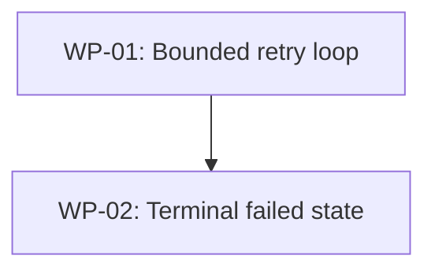

# Decomposition — Add a retry budget to the export worker

## Break pattern: API/Backend Feature

This follows the API/Backend break pattern: the data shape (attempt counter,
terminal state) is established first, then the behavior that consumes it. The
two units split along a clean seam — counting attempts is independent of what
happens when the count is exhausted — so each is verifiable on its own.

## Units

| WP | Unit | Why a unit |
|----|------|-----------|
| WP-01 | Bounded retry loop | Adds the attempt counter and the `MAX_ATTEMPTS` exit. Independently testable by call count. |
| WP-02 | Terminal failed state | Maps an exhausted budget to `status="failed"` with a reason and releases the slot. Builds on WP-01's exit. |

## Decomposition test

Each unit is well under 2 hours, has clear input/output boundaries, and is
independently verifiable (WP-01 by attempt count, WP-02 by the persisted row).
The files are disjoint enough to reason about separately, and execution is
sequential, so there is no parallel write conflict.

## Dependency graph

## Riskiest package

**WP-02** — it touches persistence and the queue-slot release, so an off-by-one
in the exit condition from WP-01 would surface here first. Mitigation: V1's seam
test pins the attempt count before WP-02's state transition is exercised.
